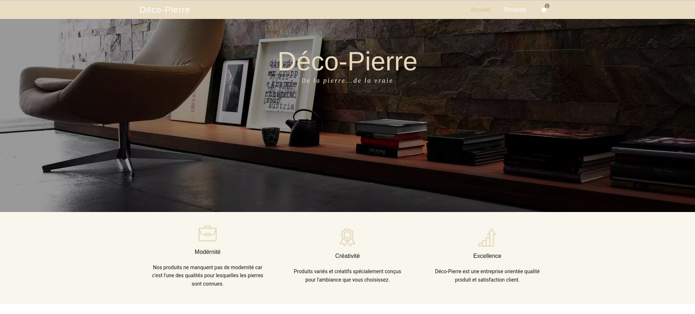

# Deco-Pierre E-Commerce Project

Deco-Pierre is a Laravel-based e-commerce platform that allows users to view and order products online. The project utilizes a MySQL database to store product information and user data, providing a seamless shopping experience. Users can browse through a variety of products, view details, and place orders directly from the platform.

## Features
- **Product Listing**: Browse a catalog of products.
- **Product Details**: View detailed information for each product.
- **Cart Management**: Add products to the cart and manage quantities.
- **Order Placement**: Checkout and place orders.




## Prerequisites

Before you begin, ensure that you have the following installed:
- **Docker**: For containerization and setting up the development environment.
- **Docker Compose**: For orchestrating multiple containers, including Laravel and MySQL.

## Installation

Follow the steps below to install and run Deco-Pierre locally using Docker.

### Step 1: Clone the Repository

Clone the project repository to your local machine.

```bash
git clone https://github.com/Omarelheni/deco-pierre.git
cd deco-pierre
```

### Step 1: Clone the Repository

This project comes with a Docker Compose file to spin up the necessary services for the application (Laravel app and MySQL database).

Build and start the containers:
```bash
docker-compose up --build
```


